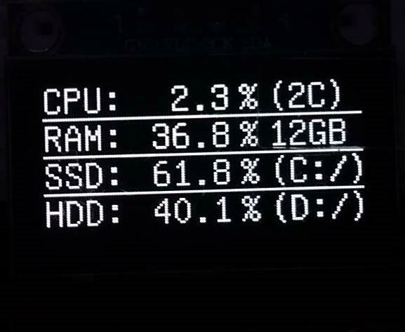

# resMon
## What is it?
resMon is relativly simple project with Arduino and OLED screen with small custom python code, that displays you PC usage (CPU, RAM and up to 2 harddrives´s free space). This is how it looks:

## Arduino 
I chose Arduino over countless other platforms because almost everyone own one, and if not, it can be bought for really cheap. Its programming language may not be the fastest and most reliable, but its really simple to use and understand and it have **giant** community and library support. I used default *wire.h* library with [**u8glib**](https://github.com/olikraus/u8glib). I paired it with chinese 128x64 OLED display interfacing throught I2C bus, to keep simplicity. Thus you can utilize Arduino Pro Micro, an OLED display, 4 wires and custom 3D printed case **(design is in WIP)** to create really tiny and cute USB powered PC usage monitor!
## Python
I created very simple python code using [**pySerial**](https://pypi.org/project/pyserial/) and [**psutil**](https://pypi.org/project/psutil/) libraries to create simple, not demanding software that gathers CPU and RAM usage alongside with free HDD/SSD space counter and send it to Arduino via *serial interface*. 
## OpenSource
Well code is in version 3.2 which i believe is final version. I will tweak possible bugs and mainly optimize python code (no, it is really not demanding, eating around 40MB of RAM and basically no CPU). Code is released under MIT OpenSource license, so feel free to fork it, tweak it, fix it, do stuff. If you find a **bug** or possibility to improve, leave an *Issue* or comment and I´ll take a look at it :)  Almost every line is commented, so there is very close to no way you won´t understand, what is going on. Just take a look...
## What´s Next?
Really this is pretty cool project (admit it..). I played around with idea of creating diskMon, raidMon and more HW/SW to display different info about PC/Server. Also, i am working on 3D model of case to use with Arduino Pro Micro to make small, portable USB powered resMon-to-go. 
## To-do list
- [x] 3D Case design [**LINK**](https://www.tinkercad.com/things/kKZvLYCUVjT )
- [ ] Optimize (and proferably clean) the code  
- [ ] HDDmon  
- [ ] Add second screen with temperature readings  
- [ ] Plot graphs  
- [x] Make an YouTube video [**LINK**](https://www.youtube.com/watch?v=c-p6RKaEpBU)  
## Libraries, links
[**u8glib**](https://github.com/olikraus/u8glib)  
[**pySerial**](https://pypi.org/project/pyserial/)  
[**psutil**](https://pypi.org/project/psutil/)  
[**YouTube Video**](https://www.youtube.com/watch?v=c-p6RKaEpBU)  
